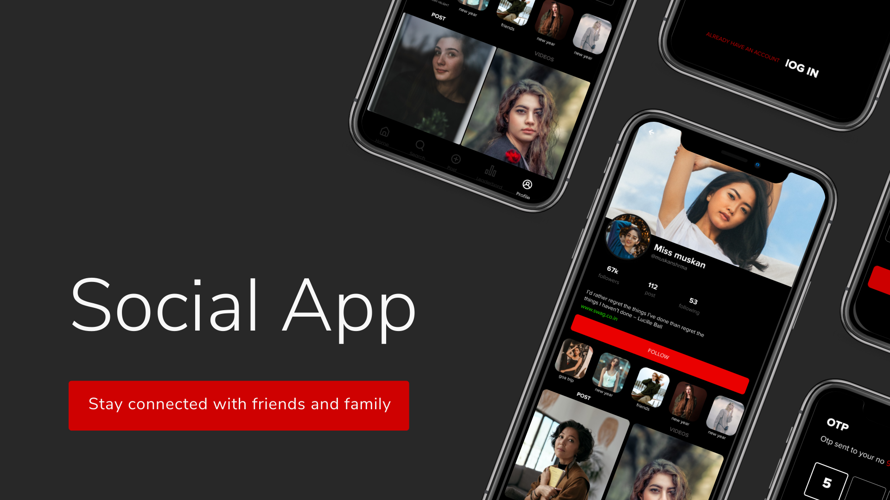
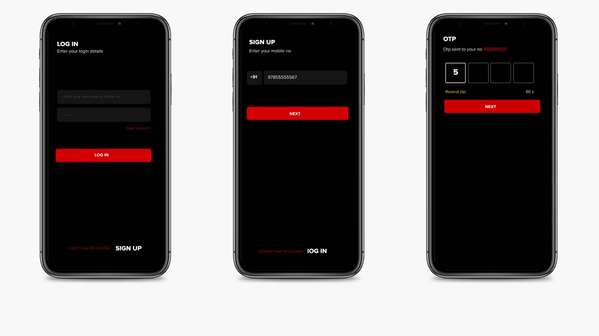
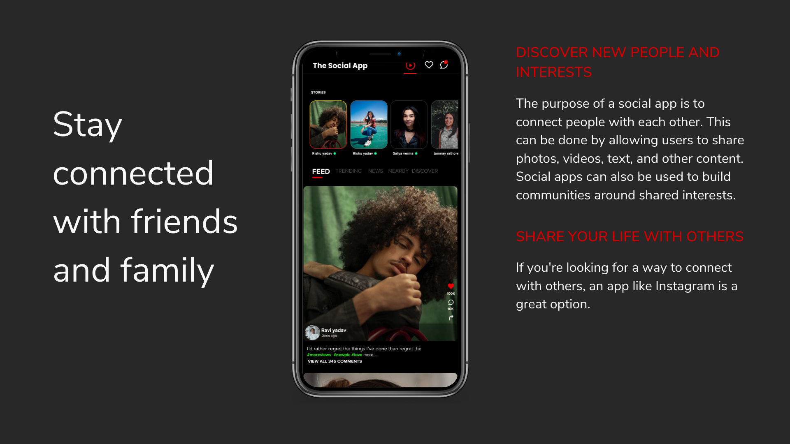
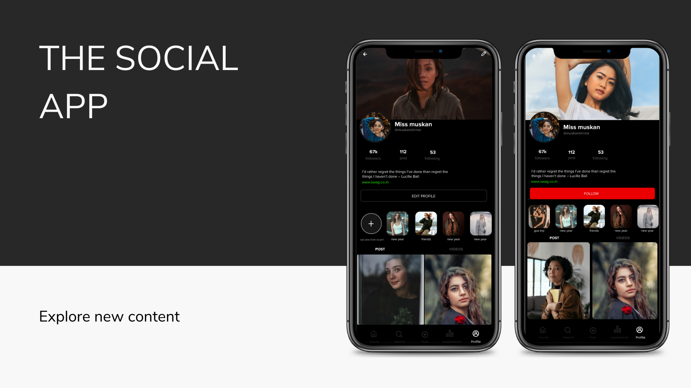

# The Social App

The Social App is built using Flutter, a modern cross-platform framework that allows developers to build beautiful, high-performance apps for both iOS and Android. The app is also built using Dart, a modern programming language that is fast, expressive, and scalable. And, the app uses JavaScript for some of its functionality, such as the chat feature.

Socialite is a powerful and versatile social media app that is built using the latest technologies. If you're looking for a social media app that is both beautiful and functional, then Socialite is the perfect choice for you.


## Features

- Simple and elegant UI
- Login, Signup, home, Profile screen
- Easy to use
- Visually appealing
- Login or signup option on welcome screen


## Screenshots







## Run Locally

Clone the project

```bash
  git clone https://github.com/Tanay-Gupta/thesocialapp


```

Go to the project directory

```bash
  cd thesocialapp
```

Install dependencies

```bash
  flutter pub get

```

Run the app:

```bash
  flutter run

```


## Contributing

Contributions are welcome! If you have any feature requests or bug reports, please feel free to open an issue or a pull request.

See `contributing.md` for ways to get started.

Please adhere to this project's `code of conduct`.


## License

This project is licensed under the [MIT License](https://choosealicense.com/licenses/mit/).

